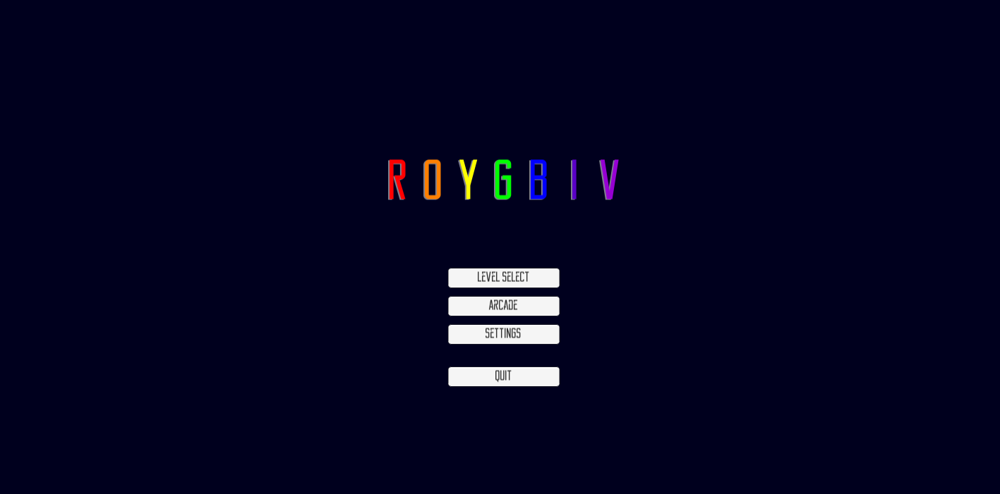
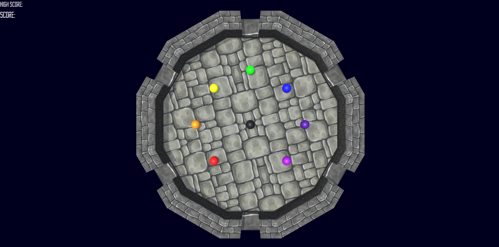
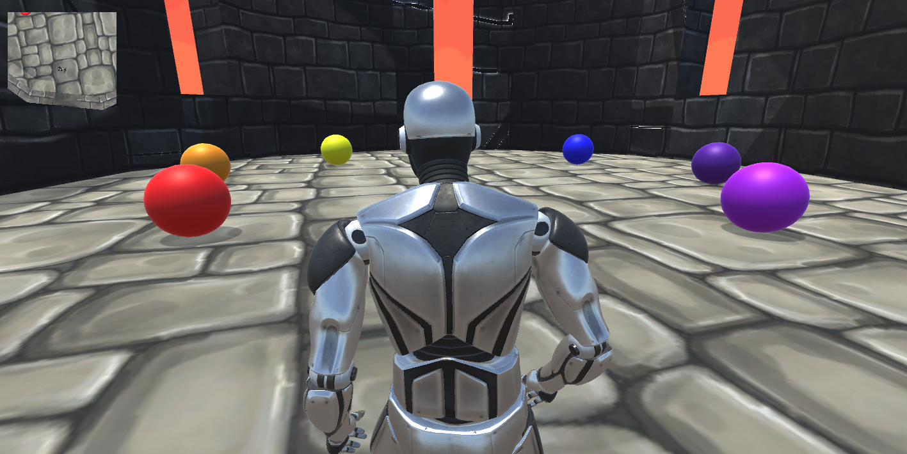
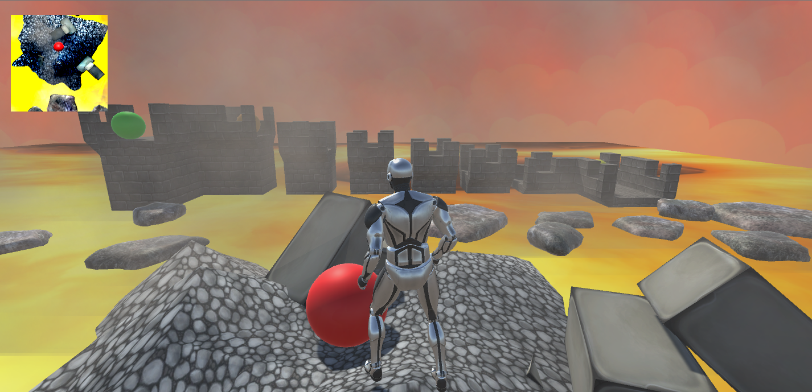
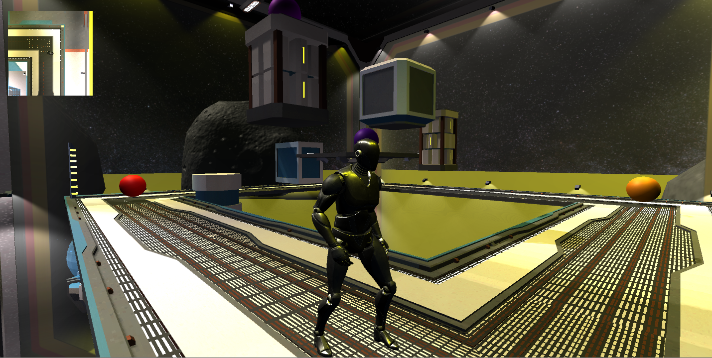
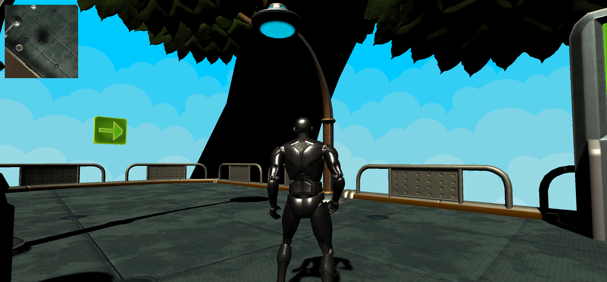
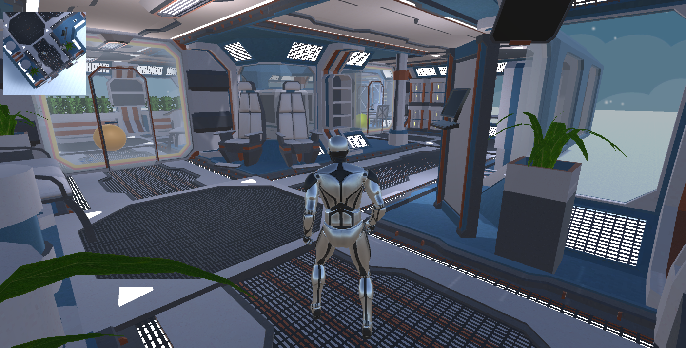
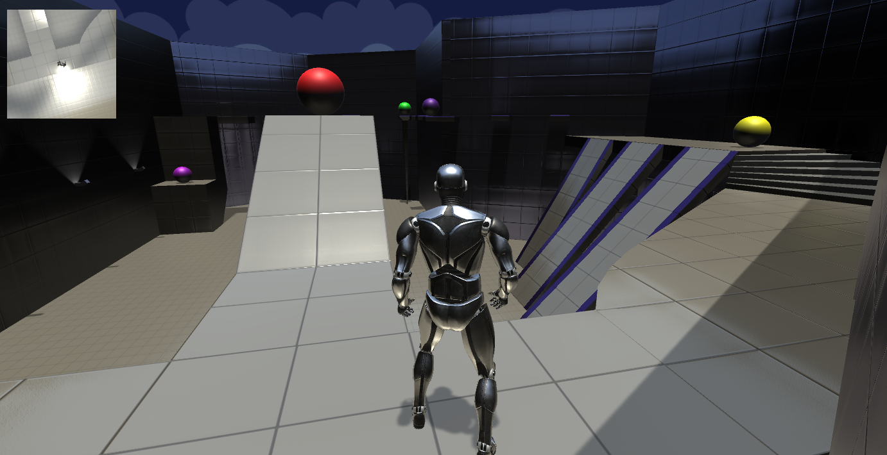
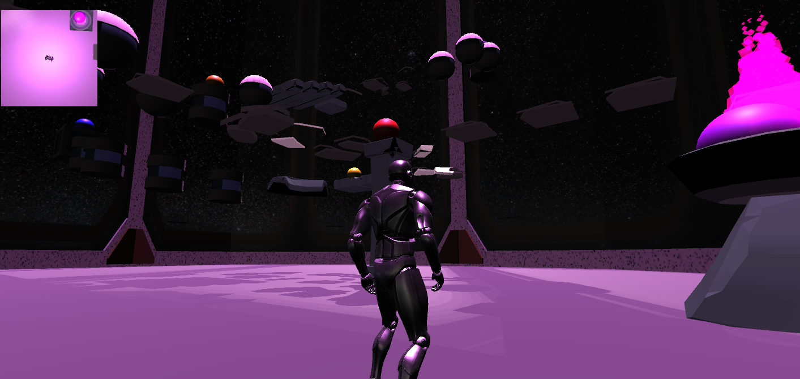

Capstone 2017-2018 (Group of 5)

Roygbiv is platformer game where the objective is to hit the rainbow colored balls in the sequence of red, orange, yellow, green,
blue, indigo, and violet. However, if a incorrect ball hits the player it results in a game over. Shield power up spawns when a certain amount of balls have been hit. The game gets harder as the player progress through the 7-levels. 

  
 
 Menu

  
  Arcade

  

  

  

  

  

  

  

